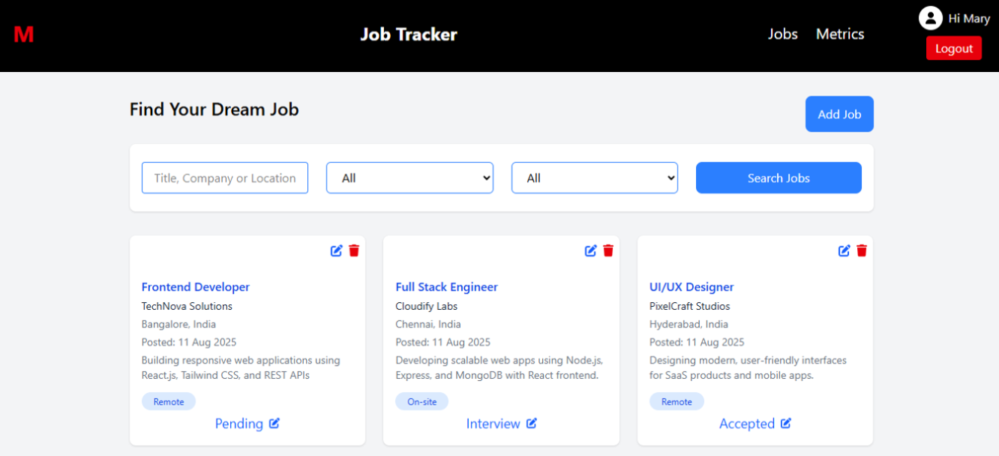

# 📌 Job Tracker App

A **React** and **Tailwind CSS** based web application to track job applications, manage interview progress, and stay organized during the job search process.

🚀 **Live Demo:** [https://career-track.netlify.app/](https://career-track.netlify.app/)  
📂 **GitHub Repo:** [https://github.com/yourusername/job-tracker](https://github.com/yourusername/job-tracker)

---

## ✨ Features
- 📋 Add, edit, and delete job applications
- 🔍 Search & filter applications by company, status, or position
- 📊 View application statistics (applied, interview, rejected)
- 📱 Fully responsive design with Tailwind CSS
- 💾 Data persistence using Local Storage / API

---

## 🛠️ Tech Stack
- **Frontend:** React, Tailwind CSS
- **State Management:** React Hooks (useState, useEffect, useContext)
- **Storage:** Local Storage / Mock API
- **Hosting:** Netlify / Vercel

---

## 📸 Preview


---

## ⚡ Installation & Setup
Follow these steps to run the project locally:

```bash
# 1. Clone the repository
git clone https://github.com/yourusername/job-tracker.git

# 2. Navigate into the project folder
cd job-tracker

# 3. Install dependencies
npm install

# 4. Start the development server
npm start